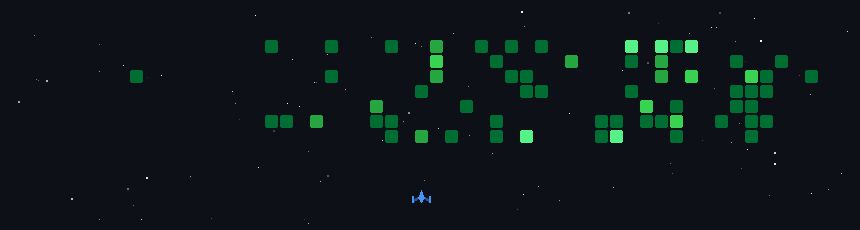

<h1 align="center">Hey 👋 I am Enzo!</h1>

<table>
  <tr>
    <td width="70%">
      <h3>
        I'm a Computer Engineering student with a passion for backend development and game development. 
        I love understanding how systems work under the hood and building software that is clean, efficient, and meaningful.
      </h3>
    </td>
    <td width="30%" align="right">
      
    </td>
  </tr>
</table>

<h2 align="left">💻 Tech Stack</h2>

###

  
  
  
  
  
  
  
  
  
  
  
  
  
  
  
  
  
  
  
  
  
  
  
  
  
  
  
  
  
  
  
  
  
  
  
  
  
  
  
  
  
  
  
  
  
  
  
  
  
  
  
  
  
  
  
  
  
  
  
  
  
  
  
  
  
  
  
  
  
  
  
  
  

###

<h1 align="left">🌐 Socials:</h1>

###

  

  

  

  

<h2 align="left">📊 GitHub Stats</h2>

  
  

 
 

<h2>🚀 My Projects</h2>

  
  

  

###
